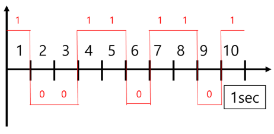
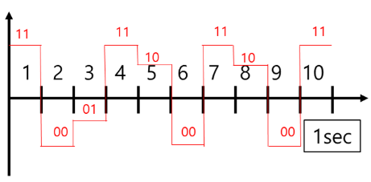

#통신

- 초당 전송 Symbol 수
	Symblol : 물리적인 단위, 하나 이상의 bit
- 주로 비동기 통신
- [Bit_Rate](Bit_Rate.md) 와 다른 개념
##### 1Bit Symbol 
- 일반적인 통신
- symbol = 1bit
- 낮은 데이터 속도
- 높은 [SNR](SNR.md) 환경
- #BPSK 이진 위상 변조

##### 2Bit Symbol
- Symbol 하나 당 네 가지의 다른 상태
- 위성 통신, WiFi
- #QPSK 사진 위상 변조
- 높은 데이터 전송률
- 높은 [SNR](SNR.md) 환경
