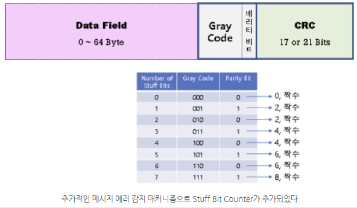
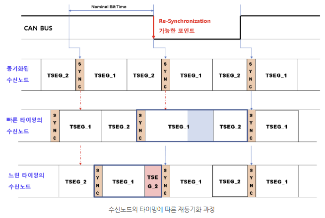
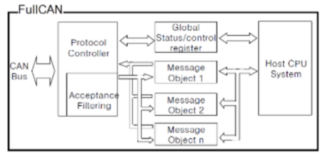

- History
    - 1986년 : 기존의 자동차 내부 [ECU](ECU.md)간 Mesh Topology 통신을 대체하기 위해 독일의 Boach와 Intel이 개발
    - 1987년 : Intel이 CAN 컨트롤러 칩을 양산
    - 1988년 : BMW 8시리즈에 첫 탑재
    - 1980년 : 2.0으로 업데이트

| Topology | Speed ([Baud_Rate](Baud_Rate.md))           | 거리    |        |                               |                       |                   |         |
| -------- | ------------------------------------------- | ----- | ------ | ----------------------------- | --------------------- | ----------------- | ------- |
| #Bus     | ≤5Mbps (High Speed) ≤125Kbps (Low Speed) | 중-장거리 | #비동기통신 | [Half-Duplex](Half-Duplex.md) | 이벤트 구동 방식             | [OSI](OSI.md) 1 & | #차동신호전송 |
|          | High Speed CAN과 Low Speed CAN사이에는 Gateway필요 |       |        |                               | [CSMA/CA](CSMA/CA.md) |                   |         |

### OSI 계층
| Data Link Layer | CAN Protocol | 1. LLC (Logical Link Control)         - message filtering         - overload notification         - error recovery procedure 2. MAC (Medium Access Control)         - message framing         - arbitration         - acknowredgement         - error detection/signaling            | - Frame 동기화 - Data Protection                                                 |
| --------------- | ------------ | ------------------------------------------------------------------------------------------------------------------------------------------------------------------------------------------------------------------------------------------------------------------------------------------------------------ | -------------------------------------------------------------------------------- |
| Physical Layer  | CAN Physical | 1. PLS (Physical Signallong) - 어떤 방식으로 정보를 전송 할 지에 대한 규약         - 논리적으로 0,1의 표현 방법, 타이밍, 동기화 2. PMA (Physical Medium Attachment)         - 구리선에 어떻게 접속하는지 3. PMS (Physical Medium Specification)         - 매체와 관련 4. MDI (Medium Dependent Interface)         - 정보 전송을 하는 매체와 관련 규약 | - 구리선 2개를 꼬아 노이즈 억제 - CAN Transceiver라는 하드웨어에서 구리선으로 송수신 되는 물리 신호를 디지털 신호로 변환 |

| [CSMA/CD](CSMA/CD.md) | Ethernet | 재밍 신호를 통해 전송 중인 데이터를 무효화하고 실패한 데이터를 재 전송             |
| --------------------- | -------- | ---------------------------------------------------- |
| [CSMA/CA](CSMA/CA.md) | CAN      | 전송 중인 데이터의 무효화 없이 충돌된 데이터의 우선순위에 따라 우선순위가 높은 데이터를 전송 |

Dominant : Differential signal difference is 1
Recessive : Differential signal difference is 0

#### CAN Message Frame
##### CAN Data Frame
	 : 데이터 전송
	- RTR bit : Dominant (0)
##### CAN Remote Frame
	: 데이터 재요청
	- Data Frame 보다 우선 순위가 낮음 (재요청이므로)
	- 차량에서는 실제로 잘 사용하지 않음 → 주기적으로 데이터를 전송함
	- RTR bit : Recessive(1)
##### CAN Extended ID
	: ID 11bit → ID 29bit
	- IDE bit로 구분
	- 기본 RTR bit → SRR bit이 되고 항상 Recessive(1)
##### CAN FD (CAN with Flexible Data rate)
	- Data Field 최대 64 Byte
	- 전송 속도 ≤8Mbps
	- Data Field 전송시 더 빠르게 전송 가능
	- CAN FD Data Frame Standard Format / CAN FD Data Frame Extended Format 

| 2.0A Data Frame           |                   | 기능                                                                                                                                                                                                                       |
| ------------------------- | ----------------- | ------------------------------------------------------------------------------------------------------------------------------------------------------------------------------------------------------------------------ |
| SOF (Start OF bit)        | SOF               | - 메시지의 전송 시작 - Falling Edge를 기준으로 버스에 있는 다른 노드들이 동시의 비트 길이 계산 - Hard Synchronization                                                                                                                               |
| Arbitration Phase         | ID RTR         | 메시지 ID가 작을 수록 우선순위가 높음                                                                                                                                                                                                   |
| Control Field             | IDE DLC        | IDE : Standard Frame인지 Extended Frame인지 확인 DLC : 통신 대역폭을 절약을 위해 유연하게 데이터 필드의 길이를 조절 8 이상으로 설정되면 8로 인식                                                                                                              |
| Data Field                | Data Field        |                                                                                                                                                                                                                          |
| Check Field               | CRC DEL        |                                                                                                                                                                                                                          |
| ACK Field                 | ACK               | CRC가 정상적이면 ACK : 0 (dominant) CRC가 비정상적이면 ACK : 1 (recessive) 단 하나의 노드만 정상적으로 인식해도 정상적으로 송신했다 판단                                                                                                                   |
| End of Frame Intermission | DEL EOF ITM | 프레임의 끝을 표기 11개의 1 (rececive)가 버스에서 보일 때 Idel상태로 인식  DEL(1bit) + EOF(7bit) + ITM(3bit) Bit Stuffing : 우연히 11개의 1 (recessive)가 보일 수 있으므로 CAN Tranciever는 5개의 같은 값을 가지는 bit 뒤에 이 와 반대되는 비트 값(stuffing bit)을 버스에 넣음 |

##### CAN2.0A (Standard)

| SOF        | 메시지의 전송 시작 표시 : 0                                                         |
| ---------- | ------------------------------------------------------------------------- |
| ID         | 메시지의 우선 순위                                                                |
| RTR        | Data Frame, Remote Frame 구분                                               |
| IDE        | Frame Format 표기 0 : Standard Frame Format 1 : Extended Frame Format |
| r0         | 미래 추가 기능을 위한 bit                                                          |
| DLC        | 데이터 길이 (4bit)                                                             |
| Data Field | 데이터                                                                       |
| CRC        | 에러 확인                                                                     |
| DEL        |                                                                           |
| ACK        |                                                                           |
| DEL        |                                                                           |
| EOF        |                                                                           |
| ITM        |                                                                           |

##### CAN2.0B (Extended)
    
| SOF        | 메시지의 전송 시작 표시 : 0                                                         |
| ---------- | ------------------------------------------------------------------------- |
| ID         | 메시지의 우선 순위                                                                |
| SRR        | Dummt Bit : 1                                                             |
| IDE        | Frame Format 표기 0 : Standard Frame Format 1 : Extended Frame Format |
| ID Ext     | 메시지의 우선 순위                                                                |
| RTR        | Data Frame, Remote Frame 구분                                               |
| r1         | 미래 추가 기능을 위한 bit                                                          |
| r0         | 미래 추가 기능을 위한 bit                                                          |
| DLC        |                                                                           |
| Data Field |                                                                           |
| CRC        |                                                                           |
| DEL        |                                                                           |
| ACK        |                                                                           |
| DEL        |                                                                           |
| EOF        |                                                                           |
| ITM        |                                                                           |

##### CAN FD (Standard)
    
| SOF        | 메시지의 전송 시작 표시 : 0                                                                                                                                  |
| ---------- | -------------------------------------------------------------------------------------------------------------------------------------------------- |
| ID         | 메시지의 우선 순위                                                                                                                                         |
| RRS        | Data Frame, Remote Frame 구분                                                                                                                        |
| IDE        | Frame Format 표기 0 : Standard Frame Format 1 : Extended Frame Format                                                                          |
| FDF        | 0 : Classic CAN 1 : CAN FD Frame                                                                                                                |
| r          | 미래 추가 기능을 위한 bit                                                                                                                                   |
| BRS        | 0 : Data Field Baud Rage 변경 X (새로운 Tranciver 필요X) 1 : Data Field Baud Rage 변경 O (새로운 Tranciver 필요O) BRS이후부터 Baud Rate변경, CRC Del에서 Baud Rate 복구 |
| ESI        | 0 : 송신 노드가 Error Active 1 : 송신 노드가 Error Passive                                                                                                |
| DLC        | 4bit 0-8 : 0-8byte 8-15 : 12-64byte (4의 배수)                                                                                                  |
| Data Field | 0-64byte                                                                                                                                           |
| CRC        | 21-25bit - Gray Code (3 bit) - Parity (1bit) - CRC (Data Filed ≤ 16 : 17 bit Data Filed > 16 : 21 bit)                                    |
| DEL        |                                                                                                                                                    |
| ACK        |                                                                                                                                                    |
| DEL        |                                                                                                                                                    |
| EOF        |                                                                                                                                                    |
| ITM        |                                                                                                                                                    |
	
	Remote Frame은 Data Field가 없어 Baud Rate를 바꿀 필요가 없으므로 별도의 CAN FD Remote Frame은 없음

### 에러 처리
#### Error Detect
- Bit Monitoring
	송신한 노드는 어떤 비트를 전송했는지 알고 있으므로 전송 비트와 수신 비트를 직접 비교하여 비트 에러를 판단
- ACK Check
	수신 노드가 메시지를 정확히 수신하면 ACK비트에 Dominant(0)
	단 하나의 노드라도 정확히 수신하면 Dominant(0)가 됨
	수신하지 못하였으면 ACK 뒤에 Error Flag
- Stuff Check
	CAN Tranciver는 5개의 같은 값을 가지는 비트 뒤에 반드시 반대 비트값을 추가
- Form Check
	Delimiter와 EOF 비트는 반드시 Rececive(1)을 가지고 있어야 함
- CRC Check
	수신한 노드는 CRC를 계산하여 오류 확인
- ACK Bit Mornitoring
	수신한 노드는 CRC Check를 하고 올바르면 ACK비트에 Dominant(0)를 전송 → NACK bit
#### Error Frame
- 6개의 Dominant(0)으로 구성
- Stuff나 Form Error를 일으키도록 하여 전송 방해
- 전송 노드에서 ACK비트가 Resessive(1)이면 ACK Error로 판단 → Error Frame전송
- 한 노드만 수신 못한 경우
	- 수신하지 못한 노드는 ACK Delimiter 후에 Error Frame전송
	- Recessive(1)로 구성된 End Frame이 전송되어야 하지만 버스에 Dominant(0)가 실리면서 Form Error
#### Fault Confinement
- Error Counter
	- CAN통신 버스 네트워크에 참여하는 모든 노드의 CAN Controller는 2개의 8bit register를 관리
	- CAN Bus에서의 결함을 제한을 목적(Fault Confilnement)
		1. TEC : 전송 에러를 카운트
		2. REC : 수신 에러를 카운트
	- TEC나 REC가 특정 값을 초과하면 해당 노드는 에러를 제어하기 위한 다른 상태로 변환
		- TEC
			- 전송 노드가 Error Flag 전송 : TEC += 8
			- 전송 성공 : TEC -= 1
		- REC
			- 수신 노드가 Error Flag를 전송 : REC += 1
			- 수신 노드가 첫 번째 Error Flag를 전송 : REC += 8
			- 성공적으로 수신 : REC -= 1
		- 송신 노드 TEC증가 속도 > 수신 노드 REC 증가 속도
			: 송신 노드가 직접 메시지를 전송하므로 결험을 찾기 쉬움
- CAN 통신 노드의 3가지 상태
	1. Error Active
		- 일반적인 상태
		- 에러가 발생하면 Dominant(0) 6개를 가지는 Error Flag전송
		- Error Flag : 6개의 연속적인 Dominant(0)
			→ 버스 위의 노드에게 Error를 알리기 위해 Dominant(0)
	2. Error Passive
		- Error Counter가 127 초과 → Error Passive상태로 변환
		- 송신에 제약 (버스 점유 불이익)
		- 송수신 가능
		- Error가 발생하지 않으면 Error Active상태로 변환
		- Error Flag : 6개의 리세시브(1)
			→ Passive 상태는 버스 상의 어떤 활동보다 우선될 수 없으므로 6개의 Recessive(1)전송
	3. Bus Off
		- Error Counter가 255 초과 → Bus off
		- 통신 불가능
		- Soft Reset or 11bit의 Recessive(1)값이 128회 반복되면 Error Active상태로 변환
- SOF 비트 딜레이
	- Error Passive상태는 버스 점유에 불이익
	- ITM 비트가 정상적으로 종료되어도, Passive 노드는 8비트를 더 기다려야 전송 가능
#### Stuff Bit Counter (CAN FD에 추가)
- SOF bit ~ Data Field까지의 Stuff Bit의 개수가 Gray Code로 변환되고 Parity가 추가됨
	

### CAN 통신 재 동기화
| SYNC | T_SEG 1 | T_SEG 2 |
| ---- | ------- | ------- |
- 메시지를 정확하게 수신하기 위해서는 모든 노드들의 `프레임의 시작 포인트`와 `비트 길이`를 알아야 함.
- 최초 동기화
	- Frame 시작 : SOF bit 수신 (Idle 상태에서 Falling Edge 수신)
	- 모든 노드들은 동일 Baud Rate로 설정되어 있어 비트 길이를 알고 있음
- 재동기화 (Re-Synchronization)
	- 노드들이 가지고 있는 클록 타이밍의 오차가 있어 비트가 지날수록 타이밍이 어긋남 → 비트 에러 증가
	- Falling Edge를 통해 동기화를 확인
		- 전송된 bit가 연속된 값이면 확인 할 수 없음 → Stuff bit에 의해 연속된 5개의 bit 다음에는 항상 다른 bit
	- Falling Edge로 동기화를 확인한 수신노드는 자신의 비트 타임을 줄이거나 늘림
- 동기화 되었는지 판단 방법
	- 비트 시간 간격(스케일 단위)로 판단
	- SYNC
		- SYNC 세그먼트 간격 안에서 Edge가 발생해야만 수신 노드가 동기화
		- Edge가 SYNC보다 빠르거나 느리면 재동기화
	- T_SEG
		- 비트 값은 T_SEG1과 T_SEG2 사이의 버스 값으로 결정
		T_SEG1
			- TSEG_1은 bit의 길이에 따라 달라짐 (bit를 읽어야 하므로 bit 중간에 위치하게 해야함.)
			- 수신 노드의 타이밍이 전송 노드보다 빨라 재동기화를 위한 비트 타이밍 시간을 연장할 때 사용.
			- 수신 노드 TSEG_1에서 Edge가 인식되면 TSEG_1을 늘려 동기화
		T_SEG2
			- 수신 노드의 타이밍이 전송 노드보다 느리면 T_SEG2의 길이는 짧아지거나 생략
			- 수신 노드가 TSEG_2에서 Edge가 인식되면 TSEG_2를 줄이거나 생략해서 동기화
	: SYNC안에서 Edge를 읽고 T_SEG1이 지난 후 bit값을 읽음.
	
	
### 최초의 CAN종류
#### Basic CAN
- 필립스에서 생산
- 메시지 큐를 사용
- FIFO로 새로 수신되는 메시지가 종류에 관계없이 queue에 채워짐

- CAN Controller
	- 비트 스트림의 생성과 확인 같은 기본적인 프로토콜 기능만 구현
	- 메시지 수신 판단, 메시지 처리 는 MCU, SW에 의해 수행
	- CPU의 부하
- Full CAN
	- intel에서 생산
	- 메시지 버퍼를 사용
	- 사용자가 원하는 크기와 개수를 지정
	- 메시지의 종류에 따라 서로 다른 버퍼에 채워짐
	- 같은 메시지를 연속으로 받으면 덮어 써지지 않도록 메시지를 다른 곳으로 이동시켜야 함
	
	- CAN Controller
		- 수신된 메시지를 처리하기 위한 객체를 가지고 있어 Filtering과 메시지 처리를 하드웨어에서 관리
		- CPU의 부담이 적음
### Non ISO CAN-FD
- 2012년 BOSCH에서 CAN FD 프로토콜을 적용한 제품을 내놓았지만 ISO 표준 제정은 2015년에 됨 (ISO 11898-2-2015)
- Non ISO CAN-FD 와 ISO CAN-FD는 서로 호환이 안됨
- ISO CAN-FD는 Stuffing Counter(Gray Code)와 Parity(Gray Code와의 합이 짝수가 되도록)를 추가
- CRC는 추가된 Gray Code와 Parity를 포함해 계산

### HS CAN과 FD CAN의 혼용
HS CAN Controller는 FD Protocol를 수신하면 Stuff Error
FD CAN Controller는 HS Protocol를 수신 가능
1. FD CAN Controller만 있는 Bus에 HS CAN Controller를 추가
2. HS는 FD protocol을 인식 불가
3. Stuff Error → Error Frame전송
4. 통신 지연
5. 두 Controller 모두 정상적인 Active상태 유지가 힘듦
HS CAN Controller에 FD Shield Tranciver를 사용하여 FD Protocol이 들어오지 않도록 막아야 함.