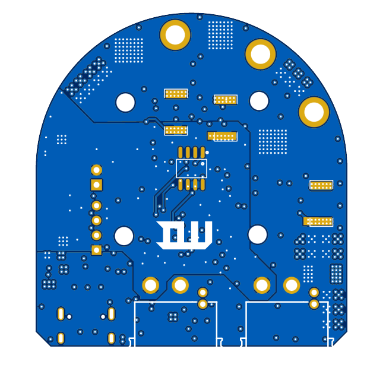
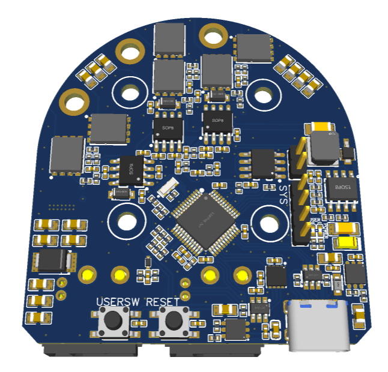
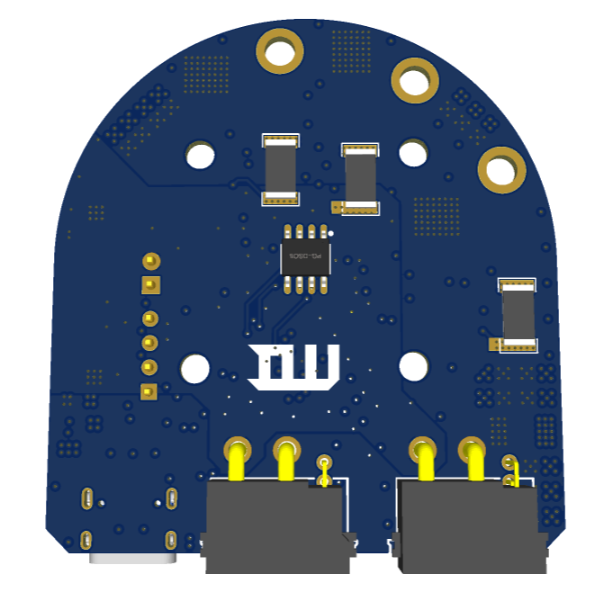
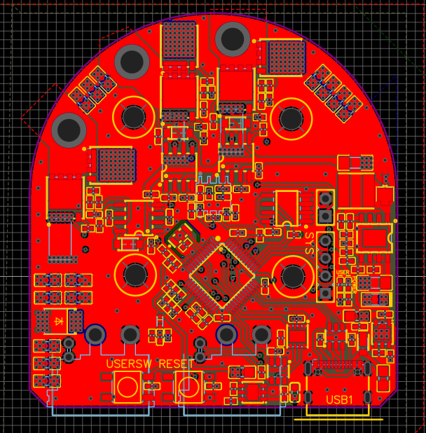
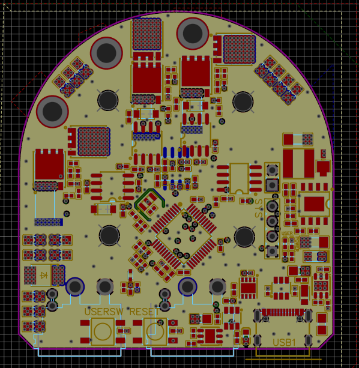
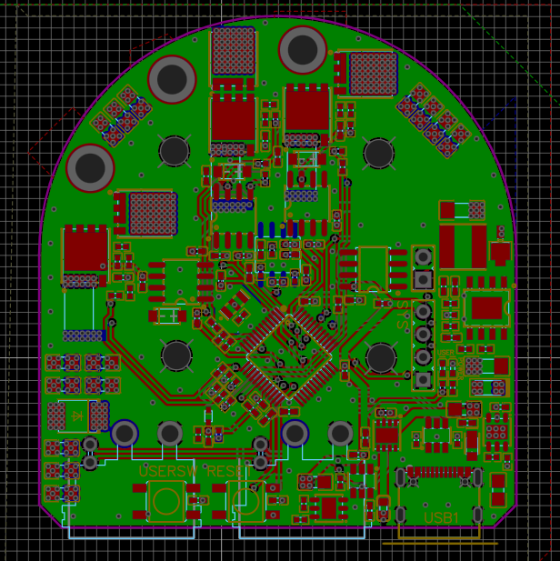
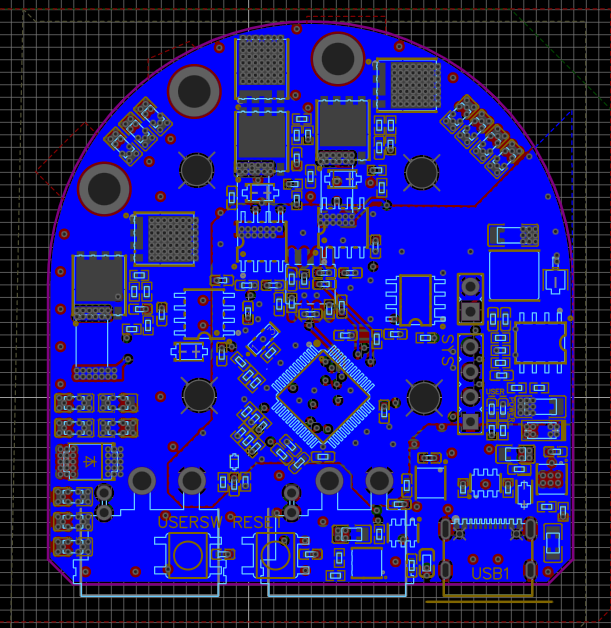

#Embedded #motor #inverter #PCB #C 

- [BLDC](BLDC.md) [FOC](FOC.md) [Actuator](Actuator.md) Project
# 데이터 시트
[MCU](MCU.md) : [STM32G474CBT6](STM32G474CBT6.md)
[Encoder](Encoder.md) : [TLE5012B](TLE5012B.md)

# 하드웨어

| PCB_Top                             | PCB_Buttom                                |
| ----------------------------------- | ----------------------------------------- |
|        |        |
|  |  |

| Layer1                              | Layer2                              |
| ----------------------------------- | ----------------------------------- |
|  |  |
| Layer3                              | Layer4                              |
|  |  |

# 소프트웨어
- ST MotorControl workbench
- STM32 CubeIDE
- STM32 CubeMX
- STM32 CubeProgramming

Language
- [[C]]
