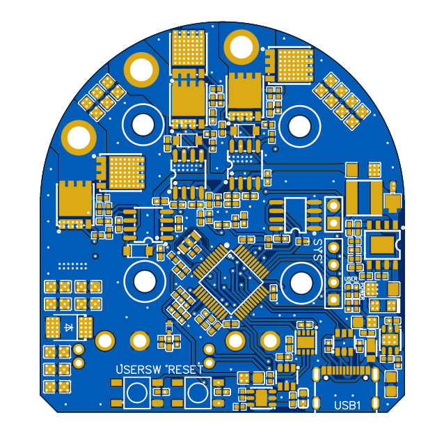

# 데이터 시트
#### STM32G474CBT6
[[MCU]]

#### TLE5012BE1000
[[Encoder]]

# 하드웨어

| PCB_Top                       | PCB_Buttom                          |
| ----------------------------- | ----------------------------------- |
|  |        |
|  |  |

| Layer1                              | Layer2                              |
| ----------------------------------- | ----------------------------------- |
|  |  |
| Layer3                              | Layer4                              |
|  |  |

# 소프트웨어
- ST MotorControl workbench
- STM32 CubeIDE
- STM32 CubeMX
- STM32 CubeProgramming

Language
- [[C]]
