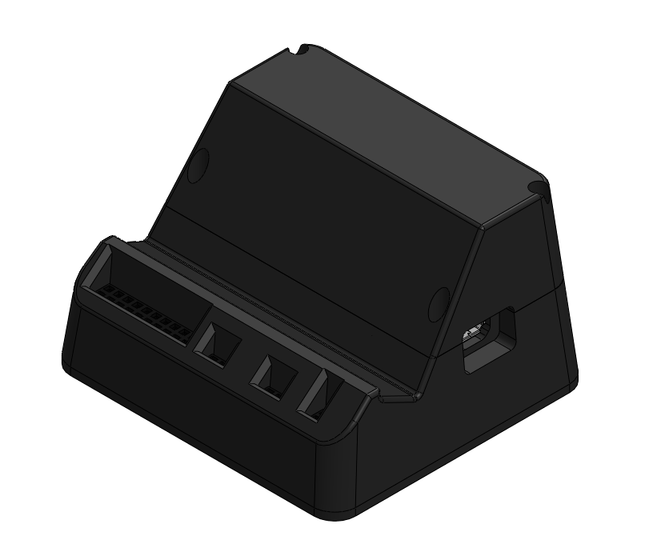
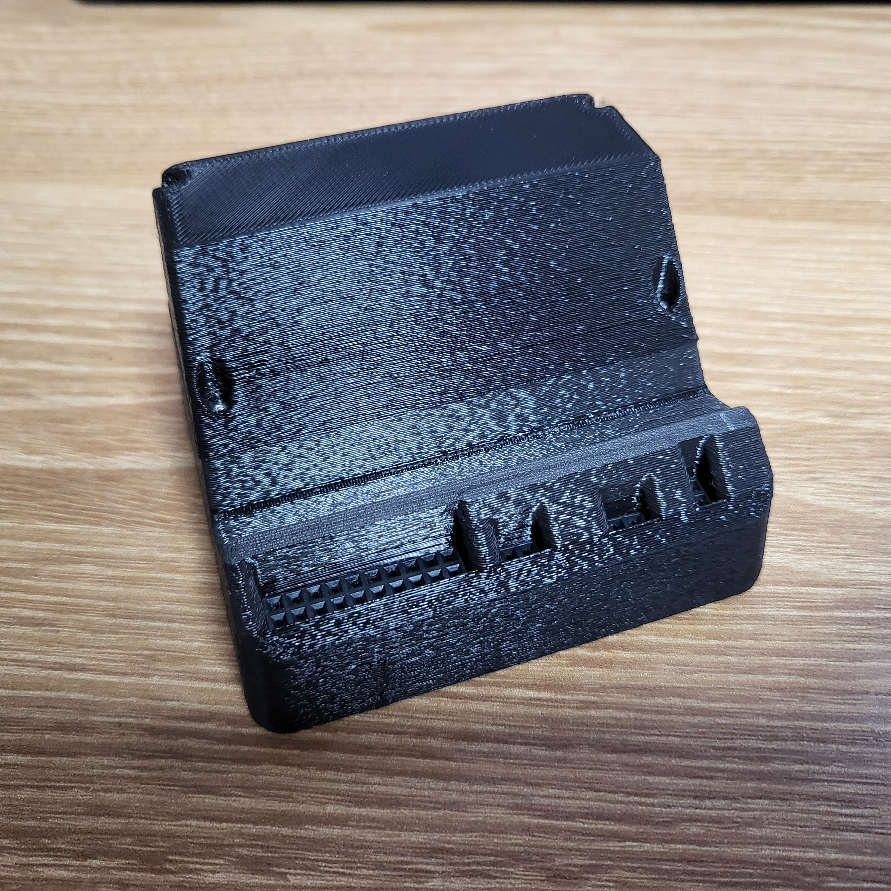
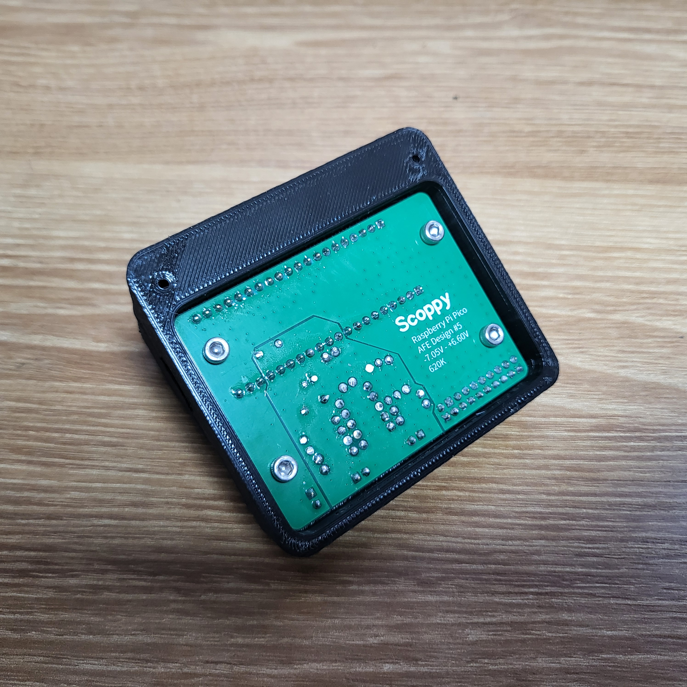
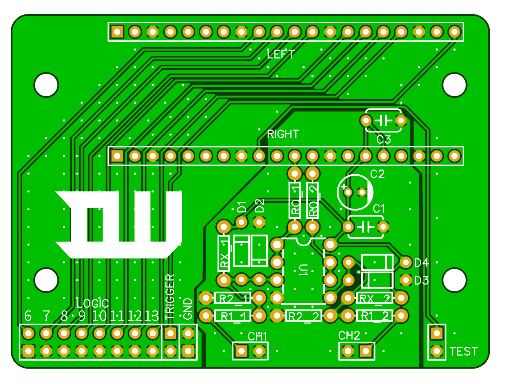
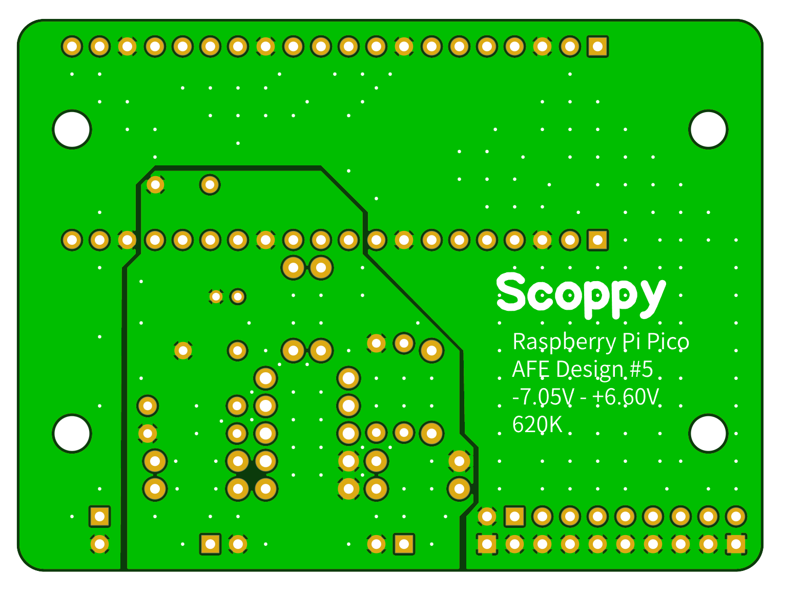
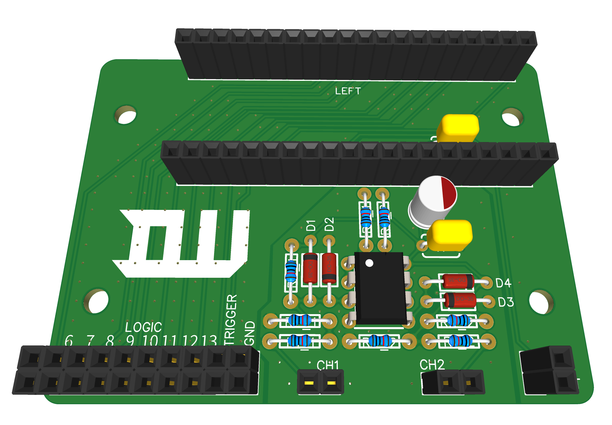
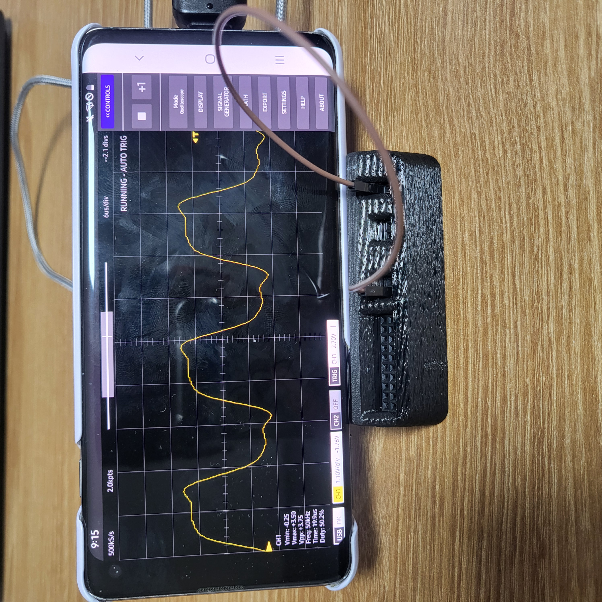

#RaspberryPi_Pico #open_source #PCB #Oscilloscope #Embedded 

Raspberry Pi Pico와 Android를 사용한 오실로스코프
## [Scoppy GitHub](https://github.com/fhdm-dev/scoppy?tab=readme-ov-file)

## [Scoppy Main Page](https://oscilloscope.fhdm.xyz/)

## [window VM 구동](https://www.youtube.com/watch?v=_g9r7l23ZEw)

# Ver 1

| Assamble                          | Assable bottom                          |
| --------------------------------- | --------------------------------------- |
|  |   |
| PCB Top                           | PCB Bottom                              |
|       |        |
| PCB 3D                            | Test                                    |
|       |  |
## Price PCB

| 품목                                                                  | 수량     | 가격(1EA)      | 총 가격   | 비고        |
| ------------------------------------------------------------------- | ------ | ------------ | ------ | --------- |
| [Raspberry Pi Pico H](https://www.icbanq.com/P015416557)            | 1      | 7,040        | 7,040  |           |
| [Resistance 220K 0.25W 1%](https://www.icbanq.com/P000871689)       | 2      | 55           | 110    |           |
| PCB                                                                 | 1      | 4,200        | 4,200  |           |
| [Pin Header Socket 1X20](https://www.icbanq.com/P014161664)         | 2      | 209          | 418    |           |
| [Pin Header Socket 2X10](https://www.icbanq.com/P014161653)         | 1      | 176          | 176    |           |
| [Pin Header Socket 1X2](https://www.icbanq.com/P014161381)          | 3      | 30           | 90     |           |
| [IC DIP Socket 8pin](https://www.icbanq.com/P014161930)             | 1      | 30           | 30     |           |
| [Resistance 470K 0.25W 1%](https://www.icbanq.com/P014164031)       | 4      | 2.09         | 8.36   |           |
| [Resistance 100 0.125W 1%](https://www.icbanq.com/P000101125)       | 2      | 1.54         | 3.08   |           |
| [Diode 1N4148](https://www.icbanq.com/P014172384)                   | 4      | 20.9         | 83.6   |           |
| [OP-AMP MCP6002-E/P](https://www.icbanq.com/P001747922)             | 1      | 909          | 909    |           |
| [Capacitor Ceramic 100nF](https://www.icbanq.com/P004732381)        | 2      | 22           | 44     |           |
| [Capacitor 10uF](https://www.icbanq.com/P000147505)                 | 1      | 46.2         | 46.2   |           |
| [Socket Junper Cable (M/M) 20cm](https://www.icbanq.com/P005643535) | -      | 2,937 (40P)  | 2,937  |           |
| M2 Bolt                                                             | 4      | 60           | 240    | Case 장착 시 |
| M3 Bolt                                                             | 4      | 50           | 200    | Case 장착 시 |
| Case                                                                | 1      | 3.000        | 3,000  | Case 장착 시 |
| Scoppy Premium                                                      | 1      | 4,300        | 4,300  | 부가        |
|                                                                     |        |              |        |           |
| Price                                                               | 16,536 | with Premium | 20,836 |           |
| with Case                                                           | 19,536 | + Case       | 23,836 |           |
