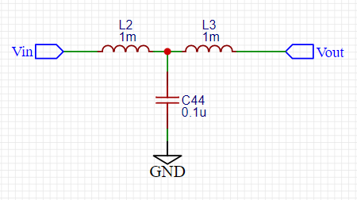

#회로 #PCB #HW

- 저주파 통과 필터
- [EMI](EMI.md)에 사용
- 입 출력 라인과  최대한 가까이 배치
- #Filter 회로가 직렬인 경우 10$K\ohm$ 이상 되도록 설계
	병렬인 경우 수 $\ohm$으로 설계
# $\pi$ 형 필터

- 평활도가 매우 우수
- 전원 회로 입력 측에서 외부 노이즈 제거를 목적으로 주로 사용
- 노이즈 주파수가 수백 MHz 이하 -> L을 [패라사이드_비드](패라사이드_비트.md)를 사용
	코일을 많이 감으면 R 증가

# T형 필터

# C input LC 필터

# L input LC 필터

$$L=V_{out} * (1 - D)\over \delta I_L * f_{sw}$$